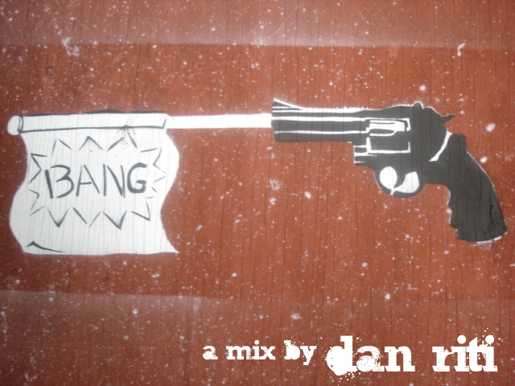

+++
title = "bang"
date = 2008-08-28

[taxonomies]
tags = ["mix"]
categories = ["mixes"]

[extra]
sidebar = false
+++

<!-- more -->

## tracklist

1. Cryptonites - Can't Give You Up (Kill The Noise Remix)
1. Chromeo - Needy Girl (Lifelike Remix)
1. Black Kids - Not Gonna Teach (The Twelves Remix)
1. Stardust - Music Sounds Better With You (DiscoTech Remix)
1. Kriss Kross - Jump (Funkanomics Planet Cross Remix)
1. Technotronic - Pump Up The Jam (Whitelabel)
1. Felguk - All Night Long (Original Mix)
1. Miles Dyson - Track From Hell (Original Mix)
1. Russ Chimes - Mulsanne
1. New Young Pony Club - The Bomb (Villians Xplosive Remix)

## description

bang is long overdue. i got lazy this summer. however, these are some funky dance tracks with some good old indie electro flair. love/hate/criticism is welcome! enjoy~

* **title**: dan riti - bang
* **beats**: funky / electro / indie house
* **time**: 45 minutes

download: [dan_riti_-_bang.mp3](/music/dan_riti_-_bang.mp3) (right click on link and click save as)
