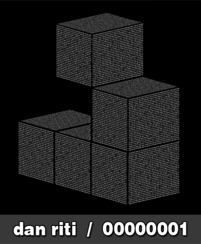

+++
title = "binary podcast 001"
date = 2012-02-02

[taxonomies]
tags = ["mix"]
categories = ["mixes"]

[extra]
sidebar = false
+++

## tracklist

1. Morris - Rashida Jones
1. King Dinosaur - Oasis Is
1. Jamie XX - Far Nearer
1. Jack Dixon - Coconuts (Disclosure Remix)
1. Sleepyhead - Nothing Changes
1. A1 Bassline - Bouyancy (Original Mix)
1. iO - Dirty Little Secret
1. Tallan - Tomorrow
1. Dark0 - HYLI (VIP Mix)
1. Damu - Ridin'
1. AlunaGeorge - It Feels So Good
1. 123MRK - Noname
1. Kastle - Technique
1. Myd - Javier (Original Mix)
1. Groove Theory - Tell Me (George FitzGerald Remix)

## description

first installment of the Binary Podcast series. going to try to put one of these out monthly/bi-monthly. leave some love if you're feeling the mix~

* **title**: dan riti - binary podcast 001
* **beats**:  future bass / future garage / post-dubstep
* **time**: 50 minutes

<iframe width="100%" height="120" src="https://www.mixcloud.com/widget/iframe/?feed=https%3A%2F%2Fwww.mixcloud.com%2Fdanriti%2Fbinary-podcast-001%2F&hide_cover=1&light=1" frameborder="0"></iframe>

download: [dan_riti_-_binary_001.mp3](/music/dan_riti_-_binary_001.mp3) (right click on link and click save as)
