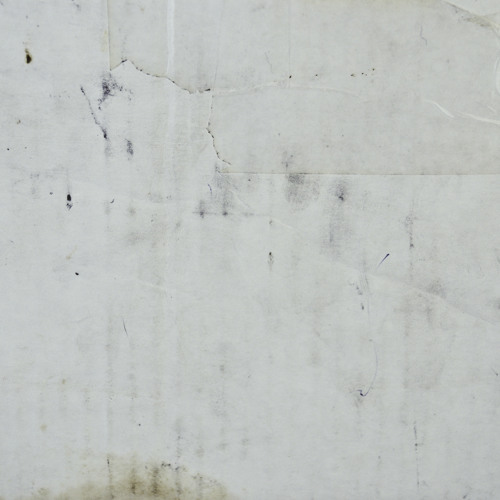

+++
title = "DGAF Four Year Anniversary Mix"
date = 2015-01-15

[taxonomies]
tags = ["mix"]
categories = ["mixes"]

[extra]
sidebar = false
+++

<!-- more -->

## tracklist

* [dgaf-four-year.txt](dgaf-four-year.txt)

## description

DGAF is turning four years old! So naturally NextHype is throwing party to celebrate:

[https://www.facebook.com/events/1546926442254937/](https://www.facebook.com/events/1546926442254937/)

In addition to the party, I made y’all a mix that contains a collection of both personal and crowd favorites that I've played at DGAF over the past four years. Clocking in at just over four hours, I figured it would be fun to commemorate each year of DGAF with an hour in this mix. I structured the mix like a typical night for me at DGAF; deep opening vibes, “breaking the ice”, peak, and closing.

A big shout out to the Colosseum and everyone who’s been a part of DGAF of the years. It’s been an honor to play my part in the Providence party scene for the last 7 years, so here’s to many more years of good dance music in Providence!

I had way too much fun making this mix, so I hope y’all enjoy it. Feel free to leave some love if you’re feeling it~

* **title**: dan riti - dgaf four year
* **beats**: bass music
* **time**: 4 hours, 17 minutes

download: [dan-riti-dgaf-four-year.mp3](/music/dan-riti-dgaf-four-year.mp3) (right click on link and click save as)
