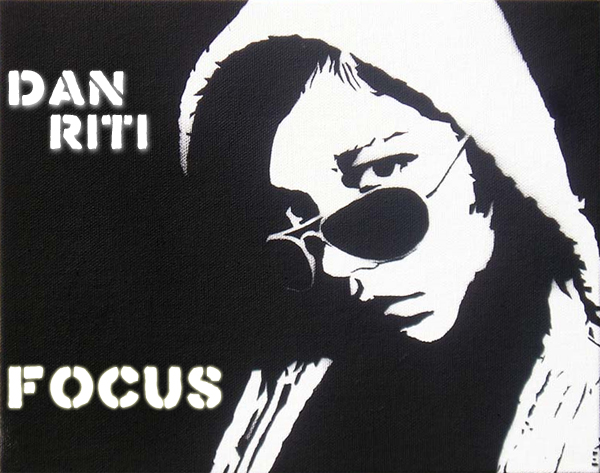

+++
title = "focus"
date = 2008-03-30

[taxonomies]
tags = ["mix"]
categories = ["mixes"]

[extra]
sidebar = false
+++

<!-- more -->

## tracklist

1. Aft Voc vs Daft Punk - On Da Dancefloor
1. Kid Creme - Austin's Groove
1. The Young Punx - Dance With Some One Else (Phunk Investigation Mix)
1. Villians - Thriller
1. Shaan Saigol - Suit and Tie
1. Mark Ronson ft. Lily Allen - Oh My God (Chris Lake Remix)
1. The Young Punx - Fire (Phonat Mix)
1. New Ordinament - Superclarke
1. Christopher & Raphael Just - Popper (Shinichi Osawa Distortion Edit)
1. Tim Davison - Spark (Jay Lumen Remix)

## description

focus is a mix i have been wanting to complete for the last few months. it's a compliation of some of my favorite tracks i've been mixing lately and really opened up a new sound that i've been flirting with while trying to still keep that indie flavor in my mixes. love/hate/criticism is welcome! enjoy~

* **title**: dan riti - focus
* **beats**: funky / indie electro mix
* **time**: 54 minutes

download: [dan_riti_-_focus.mp3](/music/dan_riti_-_focus.mp3) (right click on link and click save as)
