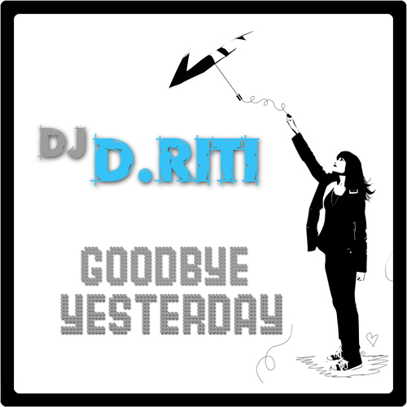

+++
title = "goodbye yesterday"
date = 2007-10-21

[taxonomies]
tags = ["mix"]
categories = ["mixes"]

[extra]
sidebar = false
+++

<!-- more -->

## tracklist

1. The Postal Service - Nothing Better (Styrofoam Remix)
1. LCD Soundsystem - North American Scum
1. The Decemberists - The Perfect Crime #2 (Robs The Bank Remix)
1. The Bravery - Fearless (Richard X Remix)
1. VHS or Beta - You Got Me (Baby Daddy Remix)
1. Justice - D.A.N.C.E (MSTRKRFT Remix)
1. Peaches - Boys Wanna Be Her (Tommie Sunshine Brooklyn Fire Remix)
1. Shiny Toy Guns - Le Disko (Tommie Sunshine Brooklyn Fire Remix)
1. The Killers - Somebody Told Me (Josh Harris Remix)
1. Afrika Bambaataa ft. Gary Numan - Metal (Richard F Remix)
1. Ghostface ft. Missy Elliot - Tush (Nevin's Porno Club Mix)
1. Fatboy Slim - Right Here Right Now (Freemasons Club Mix)

## description

 this is a mix of some of my favorite indie songs all remixed to make you want to DANCE! i put this together because i wanted to switch my style up a bit and release a mix that is guaranteed to make people sweat on the dancefloor. props to eric, elsa, dennis, and becca for initial feedback and creative input!love/hate/criticism is welcome! enjoy~

* **title**: dan riti - goodbye yesterday
* **beats**: indie / electro house mix
* **time**: 56 minutes

download: [dj_driti_-_goodbye_yesterday.mp3](/music/dj_driti_-_goodbye_yesterday.mp3) (right click on link and click save as)
