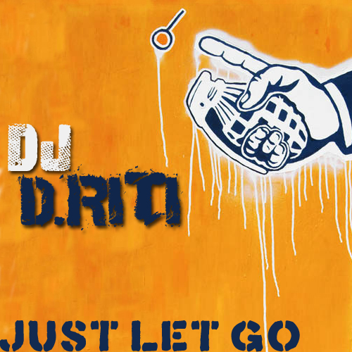

+++
title = "just let go"
date = 2007-12-16

[taxonomies]
tags = ["mix"]
categories = ["mixes"]

[extra]
sidebar = false
+++

<!-- more -->

## tracklist

1. Fischerspooner - Just Let Go (Thin White Duke Remix)
1. The Chemical Brothers - Out Of Control (Sasha Club Mix)
1. Hot Hot Heat - Just Let Me In (Josh Harris Club Remix)
1. Shiny Toy Guns - You Are The One (Sharam Jey Remix)
1. The Presets - Are You The One? (Simian Mobile Disco Remix)
1. Shape:UK - Back To Basics (Steve Lawler's Return To Rehab Mix)
1. Soulwax - Another Excuse (DFA Remix)
1. Mark Ronson - Stop Me (Dirty South Remix)
1. The Raconteurs - Steady, As She Goes (Slave To The Sunshine Remix)
1. Justice vs Simian - We Are Your Friends (Radioslave & Spencer Parker Re-Edit)

## description

as i move further into the electro/indie genre, i keep finding new songs that simply rock my socks. this is a mix of songs i selected to make you want to shake your ass and just let go. love/hate/criticism is welcome! enjoy~

* **title**: dan riti - just let go
* **beats**: electro / indie house mix
* **time**: 55 minutes

download: [dj_driti_-_just_let_go.mp3](/music/dj_driti_-_just_let_go.mp3) (right click on link and click save as)
