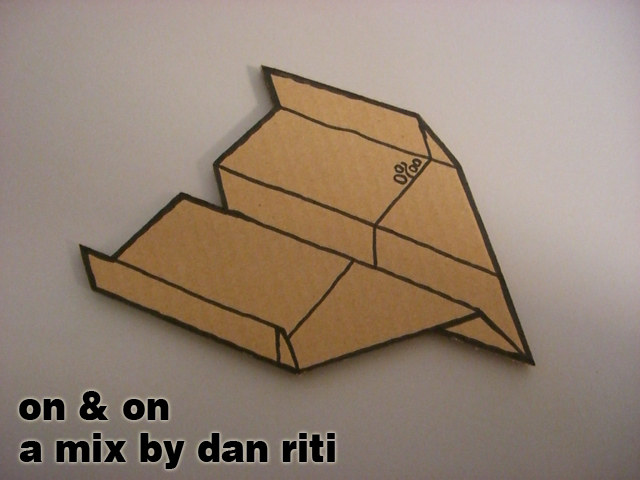

+++
title = "on & on"
date = 2011-05-12

[taxonomies]
tags = ["mix"]
categories = ["mixes"]

[extra]
sidebar = false
+++

## tracklist

1. Para - Aurora (Original Mix)
1. Lewis B. - Pinball (Original Mix)
1. Ellie Goulding - Under The Sheets (Pariah Remix)
1. Pariah - Railroad (Original Mix)
1. Jacques Greene - Tell Me
1. Darkus Beat Company - Promises (Roska Remix)
1. French Fries - With You
1. XXXY - Ordinary Things
1. Dubbel Dutch - Fool In You
1. Kingdom - Fogs (Original Mix)
1. Reso - Aethra
1. Trolley Snatcha - Always On My Mind (Original Mix)
1. Caspa - Back For The First Time (Instrumental Mix)
1. Freestylers - Cracks feat. Belle Humble (Flux Pavillion Remix)
1. Kastle - Better Off Alone
1. Magnetic Man - Perfect Stranger
1. Breakage - Justified (Original Mix)
1. Blu Mar Ten - Nobody Here (Kastle Remix)
1. Sunday Girl - Four Floors (Diplo Remix)
1. Subscape - All Day
1. Velour - Booty Slammer (Original Mix)
1. Girl Unit - Wut
1. Taz - Gold Tooth Grin
1. Guttstar - Not Money or Show (Kastle Remix)
1. Delooze - Too Heavy To Stand Up (Dark Sky Remix)
1. SBTRKT, Jessie Ware - Nervous (Original Mix)
1. Goldielocks - Addict (K-Mo Beatz Remix)
1. Kito, Reija Lee - Sweet Talk (Original Mix)
1. Avant - Read Your Mind (Shaan Saigol Remix)

## description

wow, this is way overdue. its been a long time since i've released a mix! this is a mix of some Garage, UK Funky, and Dubstep tracks that i don't have many opportunities to play out and really enjoy. i aimed to keep the vibe of the mix chill and intended this to be a listening/driving mix to groove out too. leave some love if you're feeling the mix~

* **title**: dan riti - on & on
* **beats**:  garage / uk funky / dubstep
* **time**: 1 hour, 24 minutes

download: [dan_riti_-_on_and_on.mp3](/music/dan_riti_-_on_and_on.mp3) (right click on link and click save as)
