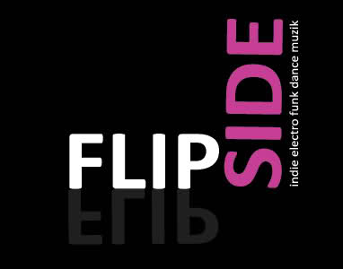

+++
title = "the flipside mix"
date = 2009-02-11

[taxonomies]
tags = ["mix"]
categories = ["mixes"]

[extra]
sidebar = false
+++

## tracklist

1. Daft Punk - Too Long
1. Mario Fabrini - Blow Dryer
1. Thomas Bangalter - Rock Shock
1. Foursome - White Label
1. Wize - Exhibition (Manuel Tur)
1. Mario Fabrini - The Answer May Surprise You
1. Superwow - Level Pants
1. Kid Creme - Austin's Groove
1. Discobuster - Groovy Thang
1. Pierre De La Touche - I Wanna Be With You
1. Olav Basoski - No One
1. Kraak & Smaak - Funky Ass Rotator
1. Miles Dyson - Maximum Funk
1. Matt Hughes - Shake Your Body
1. The Four Fuckwits - Will I
1. O'Bryan - I'm Freaky (Treasure Fingers)
1. Kevin James - I Wanna Ride
1. Chromeo - Call Me Up (Kill The Noise)
1. Unknown - Times Get Tough
1. Louis La Roche - On The Floor
1. DJ Dan - Monkey Business (Bam Bam)
1. MGMT - Electric Feel (True Psuedo)
1. Romanthony - Curious (Treasure Fingers)
1. The Young Punx - Fire (Phonat)
1. Wild Thing - Renegade Master (Fatboy Slim)
1. Kriss Kross - Jump (Funkanomics)
1. Dee-Lite - Groove Is In The Heart

## description

this is a promo mix for our new party (flipside) that we throw every month at local 121 in providence! download the mix and come check out the next flipside which is going down this week!

friday, feb 13th / flipside @ local 121 / djs kevin james & dan riti

[http://www.facebook.com/event.php?eid=48312799957](http://www.facebook.com/event.php?eid=48312799957)
[http://www.weripcrowds.com/2009/02/feb-13-flipside-local-121-djs-kevin-james-dan-riti/](http://www.weripcrowds.com/2009/02/feb-13-flipside-local-121-djs-kevin-james-dan-riti/)

enjoy.

* **title**: kevin james & dan riti present: the flipside mix
* **beats**: funky / electro
* **time**: 1 hour, 16 minutes

download: [the_flipside_mix.mp3](/music/the_flipside_mix.mp3) (right click on link and click save as)
